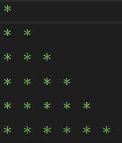
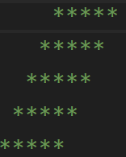
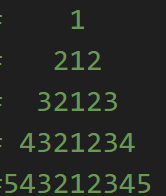
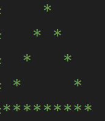

# Patterns

### 01-full_pyramid.py

### 02-inverted_half_pyramid.py

### 03-right_aligned_half_pyramid.py

### 04-right_aligned_triangle.py

### 05-increasing_right_triangle.py

### 06-repeating_numbers_triangle.py

### 07-increasing_sequence_pyramid.py

### 08-decreasing_number_triangle.py

### 09-fixed_start_decreasing.py

### 10-number_block_with_hash.py

### 11-diamond_star_pattern.py

### 12-inverted_number_pyramid.py

### 13-hollow_rectangle.py

### 14-butterfly_pattern.py

### 15-solid_rhombus.py

### 16-hollow_rhombus.py

### 17-palindromic_number_pyramid.py

### 18-border_pyramid.py
